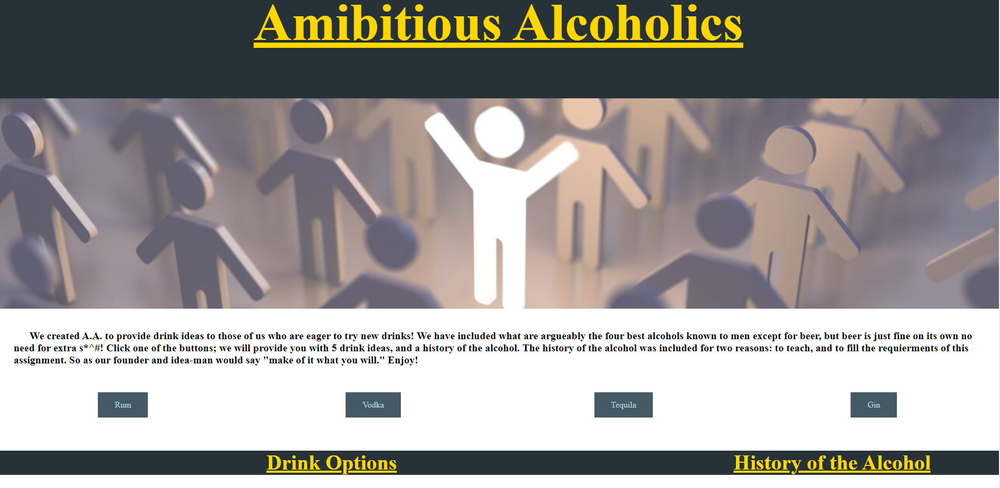
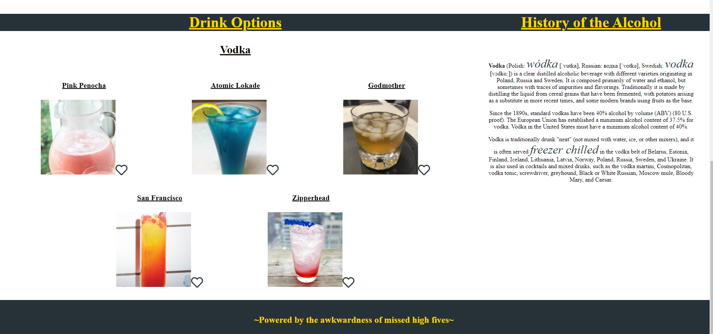

# ambitious-alcoholics
## Project Description
This project was created to provide the user with different drink options and the background and history of the users alcohol of choice. The user chooses the type of alcohol and is presented with multiple cocktails they can try. The project also gives the user the ability to favorite cocktails that they enjoy. Future development will allow the favorites list to be recalled to the user. The project calls two different API's, one to Wikipedia for the history and background of the alcohol and the other to CocktailDB for the drink options.

## Languages / Packages Used
*HTML
*Pure CSS
*JavaScript

## Live Link
https://jacobwilde378.github.io/ambitious-alcoholics/

## Screenshot / Sample Images
</img>
</img>

## Creators
* Garrett Manwaring
* Logan Page
* Jacob Wilde
